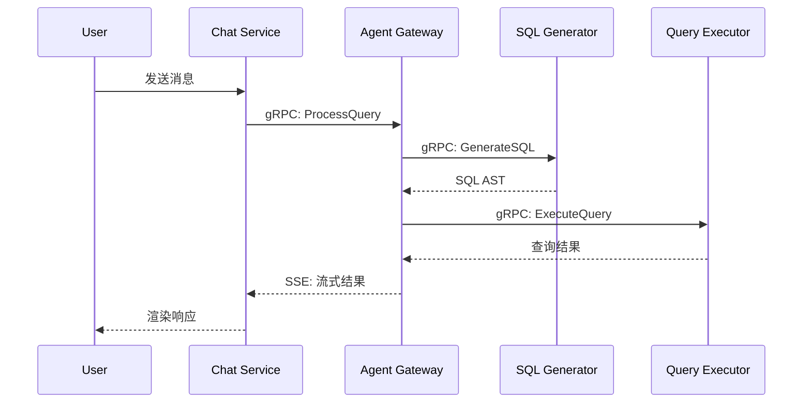

# 文档规范

## 1. 文档体系

| 文档类型 | 存放位置 | 负责人 | 更新频率 |
|---------|---------|--------|---------|
| 产品需求 | `docs/PRD.md` | PM | 需求变更时 |
| 架构设计 | `docs/architecture/` | 架构师 | 每个里程碑 |
| API 文档 | FastAPI `/docs` 自动生成 | 开发者 | 随代码更新 |
| 开发规范 | `docs/` | 团队共建 | 按需更新 |
| 运维手册 | `docs/operations/` | DevOps | 部署变更时 |
| 变更日志 | `CHANGELOG.md` | PR 作者 | 每次发布 |

## 2. 架构文档

### 2.1 目录结构

```
docs/architecture/
├── system-overview.md         # 系统整体架构
├── service-detail/
│   ├── agent-gateway.md       # 各服务详细设计
│   ├── semantic-service.md
│   ├── sql-generator.md
│   └── ...
├── data-model.md              # 数据模型设计
├── sequence-diagrams/         # 时序图（Mermaid）
└── decisions/                 # ADR（架构决策记录）
    ├── 001-sqlglot-over-string.md
    ├── 002-pgvector-over-milvus.md
    └── 003-custom-dag-over-airflow.md
```

### 2.2 ADR 模板

```markdown
# ADR-{编号}: {标题}

## 状态
已采纳 / 已废弃 / 被 ADR-xxx 取代

## 背景
<!-- 为什么要做这个决策？遇到了什么问题？ -->

## 决策
<!-- 我们选择了什么方案？ -->

## 考虑的替代方案
<!-- 还考虑过哪些方案？为什么没选？ -->

### 方案 A：xxx
- 优点：...
- 缺点：...

### 方案 B：xxx
- 优点：...
- 缺点：...

## 后果
<!-- 这个决策带来的正面和负面影响 -->
```

### 2.3 Mermaid 时序图

```markdown

```

## 3. API 文档

### 3.1 OpenAPI 文档

- FastAPI 自动生成，路径：`/docs`（Swagger UI）、`/redoc`
- 每个 endpoint 必须有 `description` 和 `response_model`
- 示例数据使用 `json_schema_extra` 或 `Field(examples=...)`

```python
from pydantic import BaseModel, Field

class MetricCreate(BaseModel):
    name: str = Field(
        ...,
        min_length=1,
        max_length=100,
        description="指标名称",
        examples=["GMV", "客单价"],
    )
    calculation: str = Field(
        ...,
        description="SQL 计算表达式",
        examples=["SUM(amount)", "COUNT(DISTINCT user_id)"],
    )

@router.post("/metrics", response_model=MetricResponse, status_code=201)
async def create_metric(req: MetricCreate):
    """
    创建业务指标

    创建一个新的语义指标，需指定指标名称和计算表达式。
    创建后会自动生成 embedding 向量用于语义检索。
    """
    ...
```

### 3.2 gRPC 文档

- Proto 文件中每个 Service/RPC/Message 必须有注释
- 使用 Buf 生成静态文档站点

```protobuf
// ResolveSchema 将用户的自然语言意图解析为结构化的 Schema 信息。
// 包括关联的指标、维度、时间范围和过滤条件。
//
// 超时：10s
// 错误码：NOT_FOUND, VALIDATION_FAILED, TIMEOUT
rpc ResolveSchema(ResolveSchemaRequest) returns (ResolveSchemaResponse);
```

## 4. 变更日志 (CHANGELOG.md)

```markdown
# Changelog

格式基于 [Keep a Changelog](https://keepachangelog.com/)，
版本号遵循 [语义化版本](https://semver.org/)。

## [Unreleased]

## [0.3.0] - 2026-06-15
### Added
- 混合检索（向量 + 关键词）支持
- Admin Dashboard 语义模型管理页面

### Changed
- NL2SQL 准确率从 65% 提升至 72%

### Fixed
- 修复 StarRocks 方言转换 DATE_ADD 参数顺序错误

## [0.2.0] - 2026-05-30
### Added
- SQL 生成核心流程
- Few-shot 示例选择引擎
- Self-Correction 纠错机制
```

## 5. README 模板

每个微服务根目录必须有 `README.md`：

```markdown
# {Service Name}

一句话描述服务职责。

## 接口
- REST: `http://localhost:8000/docs`
- gRPC: `localhost:50051`

## 本地启动
```bash
# 1. 启动依赖
docker compose up -d postgres redis

# 2. 安装依赖
uv sync

# 3. 配置环境变量
cp .env.example .env

# 4. 启动服务
uv run python -m datapilot_{service}.main
```

## 环境变量
| 变量 | 说明 | 默认值 |
|------|------|--------|
| `{SERVICE}_DATABASE_URL` | PostgreSQL 连接串 | - |
| `{SERVICE}_REDIS_URL` | Redis 连接串 | - |

## 测试
```bash
uv run pytest tests/unit/
uv run pytest tests/integration/
```

## 负责人
@developer-name
```

## 6. 代码注释规范

### 6.1 何时写注释

- **必须写**：复杂算法的业务逻辑、非显而易见的设计决策、临时方案（TODO/FIXME）
- **不需要写**：代码本身能清晰表达意图的地方

### 6.2 注释风格

```python
# 好的注释：解释 "为什么"
# 使用 RRF 重排而非 Reranker 模型，因为 Phase1 向量库规模 < 10 万条，
# RRF 计算成本远低于模型推理
results = reciprocal_rank_fusion(vector_results, keyword_results)

# 好的注释：标记待办
# TODO(DP-234): Phase2 切换为 BGE-Reranker 模型
# FIXME: StarRocks 的 DATE_ADD 在月间隔时参数顺序与 MySQL 相反

# 坏的注释：重复代码
# 遍历 metrics 列表
for metric in metrics:
    ...

# 坏的注释：无意义
# 更新 user
user.name = new_name
```

### 6.3 Docstring

仅对公共 API（模块、类、公共方法）编写 docstring：

```python
class SemanticRetriever:
    """语义检索器，支持向量检索和关键词混合检索。

    Args:
        embedding_store: 向量存储（pgvector）
        keyword_index: 关键词索引
        reranker: 重排策略
    """

    async def search(
        self,
        query: str,
        top_k: int = 10,
        filters: dict | None = None,
    ) -> list[SearchResult]:
        """执行语义检索。

        Args:
            query: 用户自然语言查询
            top_k: 返回结果数量
            filters: 过滤条件，如 {"domain": "电商"}

        Returns:
            按相关度排序的检索结果列表
        """
        ...
```

**规则：**
- 使用 Google 风格 docstring
- 禁止写无内容的 docstring（如 `"""pass"""`）
- 私有方法不需要 docstring

## 7. 文档更新触发条件

| 场景 | 需要更新的文档 |
|------|--------------|
| 新增 API 接口 | FastAPI 自动更新 + gRPC Proto 注释 |
| 修改数据模型 | `data-model.md` + ADR |
| 架构变更 | `system-overview.md` + ADR |
| 新增服务 | `system-overview.md` + 服务 README |
| 配置变更 | 服务 README 环境变量表 |
| 安全策略变更 | `security-standards.md` |
| 性能优化 | `CHANGELOG.md` |
